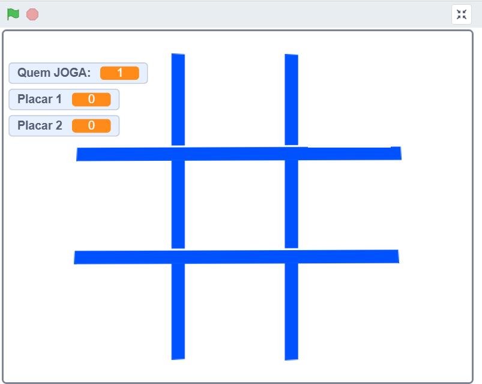

# 📁 Jogo da Velha (Tic-Tac-Toe) em Scratch

## (Parte do Repositório 'iniciacao-programacao')

Este projeto demonstra os fundamentos iniciais de lógica de programação, sendo um dos primeiros desafios completos da minha jornada de transição de carreira para a área de Tecnologia da Informação.

---

### 🚀 Objetivo do Projeto

O principal objetivo foi desenvolver o raciocínio lógico e a compreensão de algoritmos básicos (estrutura de repetição, condicionais e variáveis) necessários para qualquer linguagem de programação.

O jogo foi construído na plataforma Scratch para focar 100% na lógica do fluxo, da vitória e do controle de estados, sem a complexidade inicial da sintaxe de linguagens como Python ou JavaScript.

---

### 🎮 Regras do Jogo

- **Formato:** O jogo é uma melhor de 3.
- **Vitória:** O primeiro jogador a vencer **duas rodadas** é o vencedor final da partida.
- **Lógica Principal:**
  - Verificação de combinações vencedoras horizontais, verticais e diagonais.
  - Controle de empate ("Velha").
  - Controle de rodadas e placar (melhor de 3).

---

### ✨ O que este projeto demonstra

Embora seja um projeto em Scratch, ele comprova a minha capacidade de:

1. **Lógica Algorítmica:** Habilidade em traduzir regras complexas (como as condições de vitória) em código funcional.
2. **Controle de Fluxo:** Utilização correta de estruturas condicionais (`se/então/senão`) e _loops_ para gerenciar o estado do jogo.
3. **Resolução de Problemas:** Superar desafios de implementação de regras de pontuação para o formato "melhor de 3".

---

### 🛠️ Como Executar

Este projeto foi desenvolvido na plataforma [Scratch](https://scratch.mit.edu). Para jogar:

1. Acesse o link do projeto abaixo.
2. Clique em "Ver dentro" para explorar os blocos de código.
3. Pressione a bandeira verde para iniciar o jogo.

---

### 🔗 Link para o Projeto Online

Acesse o jogo para interagir diretamente com a lógica e as regras implementadas:

[**LINK AQUI**](https://scratch.mit.edu/projects/1177095956/)

---

### 🧩 Principais Blocos Utilizados

- Blocos de controle: `se`, `senão`, `repita até`, `aguarde`,
- Blocos de operadores: `=`, `e`, `ou`
- Variáveis: `jogadorAtual`, `placar1`, `placar2`, `Contador`

---

### 🖼️ Prévia do Jogo

__

---

### 🎯 Próximos Passos (Evolução)

O aprendizado deste projeto inicial foi essencial para o desenvolvimento de soluções mais robustas em linguagens como **Python** e **JavaScript**, que podem ser encontradas em meus repositórios principais.

---

### 📄 Licença

Este projeto está sob a licença MIT. Veja o arquivo [LICENSE](LICENSE) para mais detalhes.
